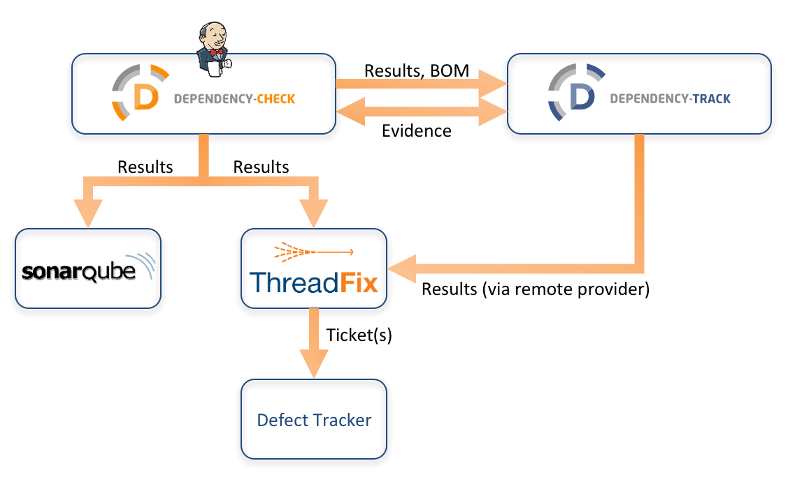

# Titre

## Cartouche d'identification

 - Manifestation : CodeursEnSeine 2018
 - Lieu : Kindarena - Rouen
 - Conférence : Détectez et trackez les vulnérabilités qui se cachent dans vos dépendances 
 - Horaire de la conférence : 12h
 - Durée de la conférence : 15min
 - Conférencier(s) :
   - Julien Topçu : (https://twitter.com/JulienTopcu)
 - Audience : 200 personnes
 - Auteur du billet : Matthieu Bonnoron
 - Mots-clés : DEPENDENCY-CHECK / DEPENDENCY-TRACK
 - URL de l'illustration : https://www.prodefence.org/wp-content/uploads/2018/05/ecosystem.png 

## Support
 - https://slides.com/julientopcu/codeurs-en-seine-2018-dtectez-et-traquez-les-vulnrabilits-qui-se-cachent-dans-vos-dpendances#/
 - Nombre de diapos du support : 12
 - Plan du support :

## Résumé
Faites-vous régulièrement les mises à jour de vos bibliothèques de développement ? Réfléchissez-vous à l'impact de ces modifications sur vos applications avant de les faire ? Des mises à jour ont elles des effets de bords sur certaines de vos application ? 

C'est avec questions que notre intervenant, Julien Topçu, commence la conférence.Il s'agit en effet d'une menace que les développeurs ne prennent pas assez en compte : les vulnérabilités qui se cachent dans les dépendances. Fort heureusement pour nous, notre orateur arrive avec un outils, avec lequel il dit pouvoir supprimer cette épée de Damoclès au dessus de nos projets : DEPENDENCY-CHECK et DEPENDENCY-TRACK.

Ces 2 outils vont permettre de scanner un projet de votre compte github déjà bien rempli, et trouver toutes les vulnérabilités de vos dépendances. Attention, cette bibliothèque n'a pas été mise à jour : elle est en version 1.2.3 alors que se nouvelle version stable est là 1.3.6. Quel outils minitieux... Mais comment sait-il tout ça ? Et dois-je lui faire confiance à chaque fois ?

Oui vous pouvez lui fare confiance, et non il ne sort pas ses conseils de son chapeau. Ces 2 outils vont requêter un base de données contenant l'ensemble des vulnaribiltés existantes connues, et comparer avec vos dépendances. Il voit une vulnérabilité connue ? Il vous la décrit précisément et vous présente tous ses risques (sa sévérité, la type de vulnérabilité...), puis vous propose une solution pour la corriger ! 

Ces outils DEPENDENCY-CHECK et DEPENDENCY-TRACK sont donc les meilleurs amis des développeurs : ils protègent vos applications dans le temps, au fur et à mesure des mises à jours de vos bibliothèques de développement.

## Architecture et facteur qualité
Maintenabilité : cette conférence avait pour but de présenter des outils pour la maintenabilité de projets informatiques
